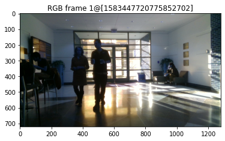

# RaDICaL Dataset SDK
> The RaDICaL Dataset: A synchronized and calibrated low-level Radar, RGB-D and IMU dataset.


This is pre-alpha research quality code, and is being actively developed on.
Anything may change at anytime. Please check back here often.

Bug reports are very much appreciated.

# TODO

 - [ ] Radar config reader
 - [x] Read from aligned H5 dataset
 - [ ] Read from raw bags (to produce aligned/unaligned H5 datasets)
 - [x] Polar to Cartesian Projection
 - [ ] Camera/Radar coordinate transforms

## Install

`python -m pip install git+https://github.com/moodoki/radical_sdk.git`

## How to use
> Dataset is currently under review and will be made available soon.

Download the dataset at our [project page](https://publish.illinois.edu/radicaldata/).
A small sample to try things our can be found [here]().


```python
#skip


from radicalsdk.h5dataset import H5DatasetLoader

data = H5DatasetLoader('../samples/indoor_sample.h5')


frame_idx = 1
plt.figure()
plt.imshow(data['rgb'][frame_idx])
plt.title(f'RGB frame {frame_idx}@{data["rgb_timestamp"][frame_idx]}')
plt.show()
plt.figure()
plt.imshow(data['depth'][frame_idx])
plt.title(f'Depth frame {frame_idx}@{data["depth_timestamp"][frame_idx]}')
plt.show()
```





